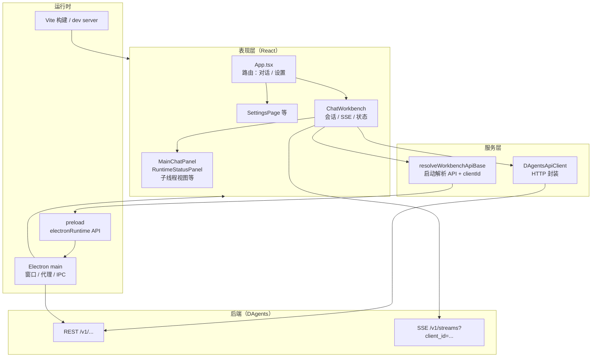
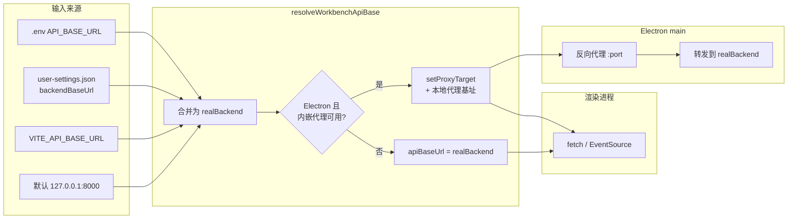
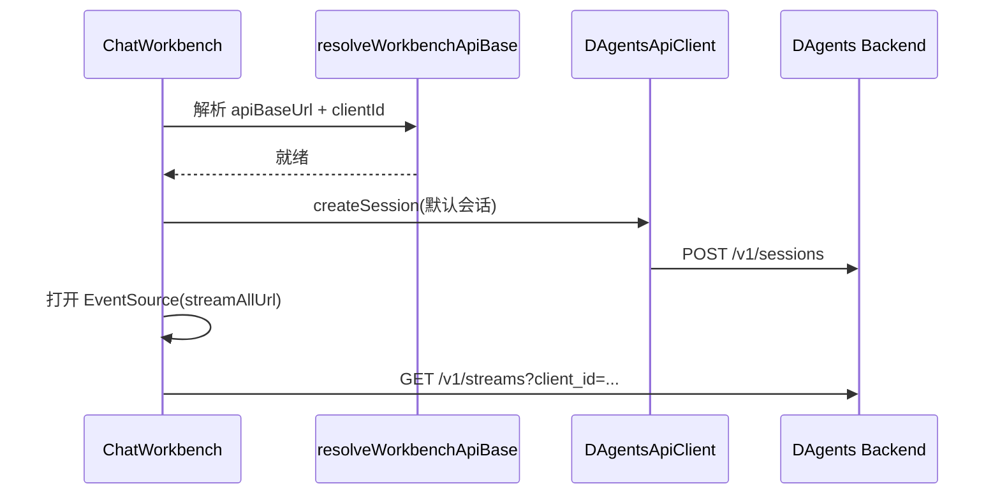
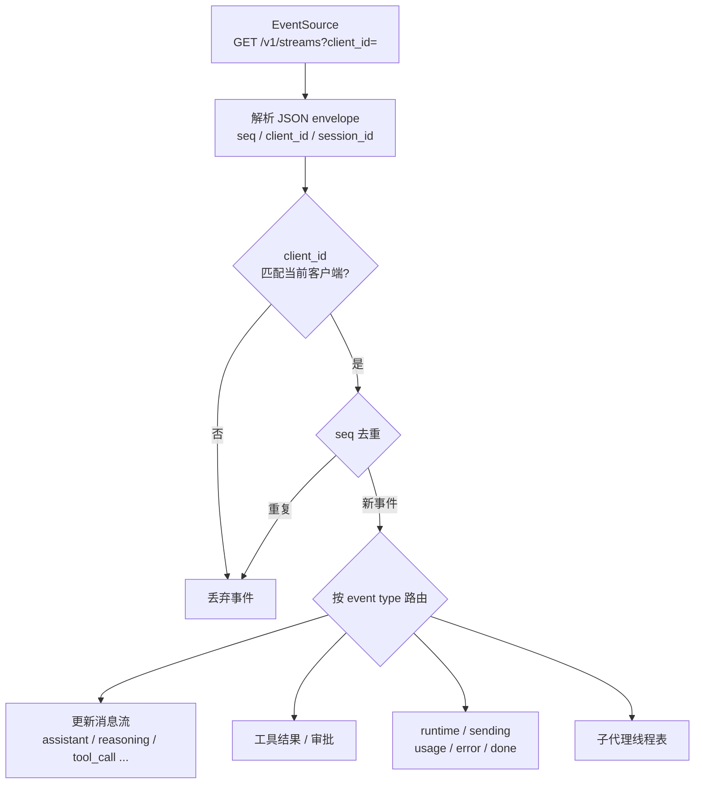
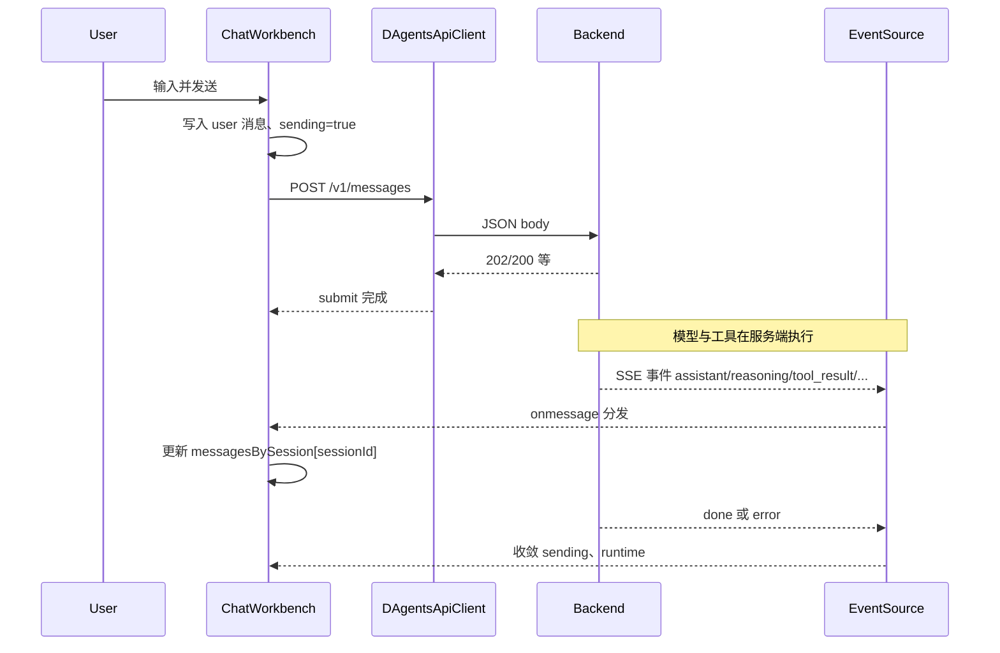
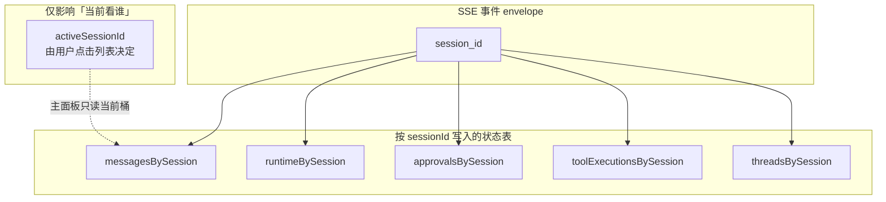
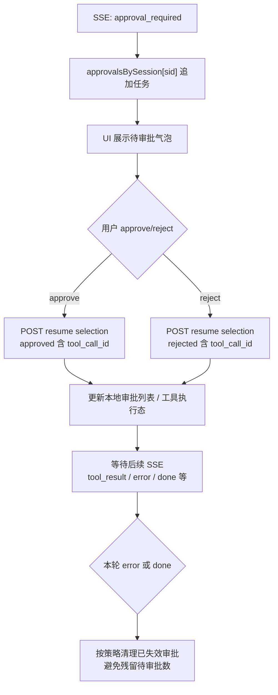
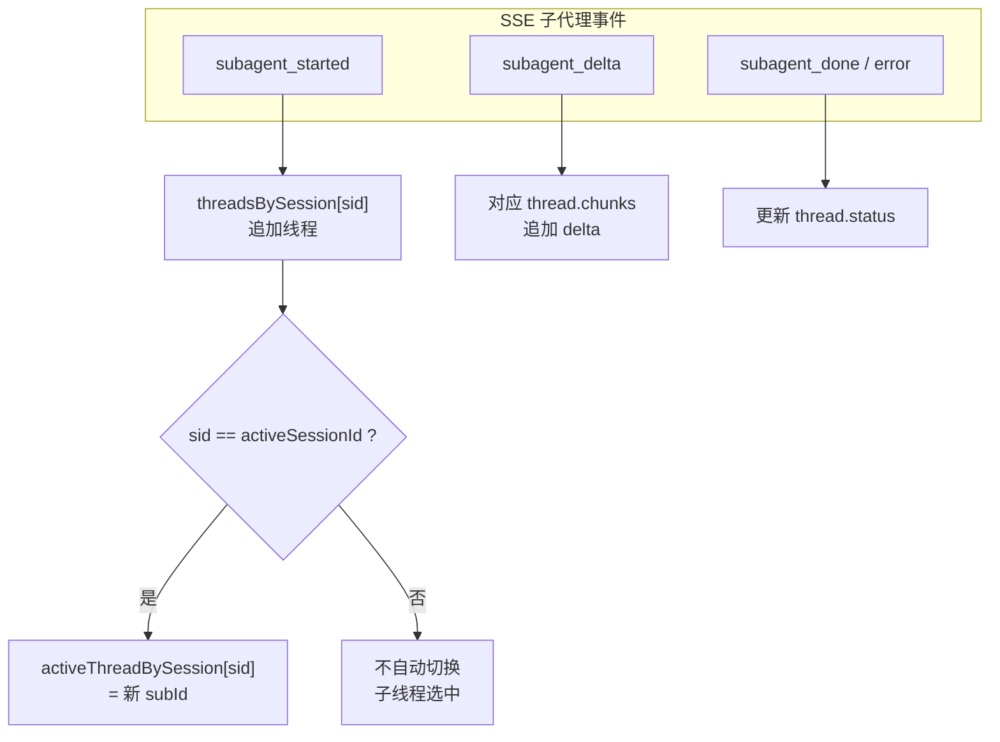

# Architecture and business flows

本文说明 **DAgentsUI**（`dagents-frontend`）的整体技术架构与核心业务流程，便于新成员接入与发布评审。  
`doc/` 下其它文档的索引与简介见 [README.md](./README.md)。

---

## 1. 项目定位

**DAgentsUI** 是面向 [DAgents](https://github.com/DGS-ai-team/DAgents) 后端的 **对话工作台前端**：

- 通过 **HTTP** 调用 REST 风格 API（以仓库根目录 `openapi.json` 为契约快照）。
- 通过 **SSE（Server-Sent Events）** 订阅多会话、多事件类型的实时流。
- 可选 **Electron** 桌面壳：窗口、用户设置持久化、内嵌 **API 反向代理**（解决部分环境下的跨域与统一入口）。

运行时形态：

| 形态 | 说明 |
|------|------|
| **Web（Vite dev / 静态 dist）** | 浏览器直接访问；API 基址通常来自 `VITE_API_BASE_URL`。 |
| **Electron** | 渲染进程仍为同一套 React 应用；主进程负责窗口、IPC、本地代理与设置文件。 |

---

## 2. 技术架构总览

### 2.1 逻辑分层

### 2.2 目录与职责（精简）

| 路径 | 职责 |
|------|------|
| `src/App.tsx` | 根视图：对话与设置切换；**保持 ChatWorkbench 挂载**（仅隐藏），避免状态丢失。 |
| `src/pages/ChatWorkbench.tsx` | 工作台核心：多会话状态、`EventSource` 单例、SSE 分发、发送消息与审批。 |
| `src/pages/chatWorkbench/resolveApiBaseUrl.ts` | 启动期解析 `apiBaseUrl`、`clientId`；Electron 下注册代理并切换到本地代理基址。 |
| `src/api/client.ts` | HTTP：`createSession`、`submitMessage`、`cancelCurrentTurn` 等；`streamAllUrl` 组装全局 SSE URL。 |
| `src/api/types.ts` | OpenAPI 生成类型（勿手改）。 |
| `electron/main.cjs` | BrowserWindow、内嵌 API 代理、`settings:*` / `proxy:*` IPC。 |
| `electron/preload.cjs` | `contextBridge` 暴露 `window.electronRuntime`。 |
| `scripts/electron-dev.cjs` | 开发：起 Vite（固定端口策略）→ 等待可访问 → 启动 Electron。 |
| `.github/workflows/desktop-*.yml` | 标签/手动触发：安装依赖、`pnpm build`、打包 `dist` + `electron` 等产物。 |

---

## 3. Electron 与 Web 的差异

跨域（CORS）、同源策略及 **Electron 内嵌代理** 的设计动机与可选方案，见专门文档：[cross-origin-solutions.md](./cross-origin-solutions.md)。

### 3.1 `window.electronRuntime`（preload 注入）

渲染进程通过统一入口与主进程协作（类型见 `src/electron-runtime.d.ts`），主要包括：

- 读取项目根 `.env` 中的 **`API_BASE_URL`**（若存在）。
- **clientId** 持久化（如 `.electron-client-id`）。
- **用户设置**读写（磁盘 JSON，路径由主进程决定）。
- **代理**：`setProxyTarget(realBackend)` + `getLocalApiProxyBaseUrl()`，使前端 `fetch`/`EventSource` 指向 `http://127.0.0.1:<proxyPort>`，由主进程转发到真实 DAgents 服务。

### 3.2 API 基址解析优先级（摘要）

实现以 `resolveWorkbenchApiBase` 为准，概念上为：

1. Electron：`.env` / 用户设置中的后端根地址。
2. 构建期：`VITE_API_BASE_URL`。
3. 默认：`http://127.0.0.1:8000`（需与后端实际监听一致）。

**解析与代理数据流（Electron 典型路径）**：

说明：走「是」分支时，渲染进程请求发往 **本地代理 URL**，主进程再转发到 **realBackend**；走「否」或代理失败回退时，**直连 realBackend**。

---

## 4. 核心业务流程

### 4.1 应用启动（bootstrap）

要点：

- **全局 SSE 单例**：一个 `EventSource` 消费所有会话事件；按 `session_id` 与 `client_id` 分发给 UI 状态。
- **clientId**：用于 SSE 过滤与消息归属；Electron 下尽量稳定持久化。

**SSE 事件进入前端后的分发（简化）**：

### 4.2 发送用户消息

1. 用户在当前 **activeSessionId** 输入并发送。
2. 本地追加 **user** 消息气泡；`sending` / `runtime.status = running`。
3. `POST /v1/messages` 提交（`request_type: message` 等字段以类型定义为准）。
4. 助手内容、工具结果、审批等由 **SSE** 异步回写；收到 `done` / `error` 等事件后收敛运行态与发送中状态。

**单轮对话：HTTP 提交与 SSE 回流（概念）**：

**前端内部：会话状态分桶（多会话并存）**：

要点：SSE **始终更新「事件所属 session」对应的分桶**；**不**应因其它会话的事件去改 `activeSessionId`（实现上通过 ref 等避免误切换）。

### 4.3 多会话与 UI 行为

- 会话列表与 `messagesBySession`、`runtimeBySession` 等按 **sessionId** 分桶。
- **切换会话**不应因其它会话的 SSE 事件而自动切换当前选中会话：通过 **ref 同步当前 `activeSessionId`** 等方式避免闭包过期导致的误跳转（详见 `ensureSessionSlot` 相关实现）。
- **设置页**：仅切换可见性，不卸载 `ChatWorkbench`，避免对话状态丢失。

### 4.4 工具审批（approval）

1. SSE `approval_required` 在对应会话下追加 **ApprovalTask**。
2. 用户在当前会话内对工具调用做 **批准 / 拒绝**。
3. 通过 `submitResume`（底层仍为 `submitMessage` 语义路径）通知后端继续或终止。
4. 轮次结束或异常时，按产品策略清理**已失效**的待审批项，避免计数与可操作状态不一致。

**审批闭环流程**：

### 4.5 子 Agent 线程（subagent）

- SSE：`subagent_started` / `subagent_delta` / `subagent_done` / `subagent_error` 更新侧栏线程列表与内容。
- **仅当事件所属会话为当前正在浏览的会话**时，可自动选中最新子线程，避免干扰用户在其它会话上的操作。

**子线程事件写入与选中逻辑（概念）**：

---

## 5. 构建、契约与 CI

| 环节 | 说明 |
|------|------|
| **类型** | 后端导出 OpenAPI → 覆盖 `openapi.json` → `pnpm gen:types` 生成 `src/api/types.ts`。 |
| **构建** | `pnpm build`：`tsc -b` + `vite build`，产物在 `dist/`。 |
| **桌面 CI** | 推送 `v*` 标签等触发；产物为含 `dist`、`electron`、`package.json` 等的压缩包（非安装器时需自备运行说明）。 |

---

## 6. 相关文档

- 根目录 [README.md](../README.md)：安装、运行、环境变量速览。
- [CHANGELOG.md](../CHANGELOG.md)：版本记录。
- [ui-behaviors.md](./ui-behaviors.md)：各 UI 区域与交互行为说明。
- [cross-origin-solutions.md](./cross-origin-solutions.md)：跨域与 CORS 技术方案。
- [src/README.md](../src/README.md)、[src/api/README.md](../src/api/README.md)、[scripts/README.md](../scripts/README.md)：子目录说明。

---

## 7. 修订记录

| 日期 | 说明 |
|------|------|
| （随仓库演进更新） | 架构或流程变更时请同步修改本节与正文。 |
