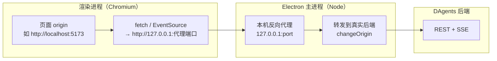

# 跨域（CORS）与同源策略：技术方案说明

本文说明 **DAgentsUI** 在访问 DAgents **与前端页面不同源** 的后端 API（含 **SSE**）时，跨域问题的成因与本项目采用的**缓解思路**与**可选方案**，便于部署与联调对齐。

---

## 1. 问题背景

### 1.1 浏览器同源策略

浏览器将「协议 + 主机 + 端口」视为 **Origin**。例如：

- 前端页面：`http://localhost:5173`（Vite 开发）
- 后端 API：`http://127.0.0.1:8000`

二者端口不同，属于 **不同源**。渲染进程内的 `fetch` / `XMLHttpRequest` / `EventSource` 访问后者时，受 **CORS** 约束：除非后端响应携带匹配的 `Access-Control-Allow-Origin` 等头，否则浏览器会拦截响应。

### 1.2 SSE 与跨域

**Server-Sent Events**（`EventSource`）同样受 CORS 限制。若后端未对 SSE 路径返回正确的 CORS 头，连接会在浏览器侧失败或无法读取流。

### 1.3 Electron 并非「自动无 CORS」

Electron 渲染进程在多数配置下仍基于 Chromium，**同样执行同源与 CORS 策略**（除非显式关闭 `webSecurity` 等，本项目**未**采用该做法）。因此需要在架构上显式处理跨域或统一入口。

---

## 2. 本项目采用的主方案：Electron 内嵌反向代理

### 2.1 思路

在 **Electron 主进程**（Node 环境，不受浏览器同源限制）内启动一台监听 **本机回环地址**（默认 `127.0.0.1:37421`，见 `electron/api-proxy.cjs` 中 `DEFAULT_PORT`）的 **HTTP 反向代理**。监听端口可通过环境变量 **`API_PROXY_PORT`**（或 **`ELECTRON_API_PROXY_PORT`**）或项目根 **`.env`** 中的 **`API_PROXY_PORT`** 覆盖，**修改后需重启 Electron**。

- 渲染进程将 **`apiBaseUrl`** 配置为 **`http://127.0.0.1:<代理端口>`**（由 `resolveWorkbenchApiBase` 在代理就绪后写入，见 `src/pages/chatWorkbench/resolveApiBaseUrl.ts`）。
- 所有 **REST** 与 **SSE** 请求先发往该本机代理；代理再将请求 **转发** 到用户配置的 **真实 DAgents 根地址**（`changeOrigin: true`，并处理 `upgrade` 以支持需升级的流式场景）。

这样可将「浏览器 ↔ 任意远端后端」的跨域问题，部分转化为「浏览器 ↔ 本机代理」的单一入口管理；**真实后端是否公网、是否 HTTPS**，由主进程转发层处理。

实现入口：

- `electron/api-proxy.cjs`：`createApiProxy`、`http-proxy`、`changeOrigin`、`upgrade`。
- `electron/main.cjs`：启动代理、`proxy:setTarget` / `proxy:getBaseUrl` / `proxy:getListenPort` IPC；解析 `API_PROXY_PORT`。
- `electron/preload.cjs`：向渲染进程暴露 `setProxyTarget`、`getLocalApiProxyBaseUrl`、`getApiProxyListenPort`。

### 2.2 数据流示意



### 2.3 与「直连后端」的对比

| 方式 | 说明 |
|------|------|
| **渲染进程直连** `http(s)://后端:端口` | 若与页面不同源，**必须**后端配置完整 CORS（含 SSE），否则失败。 |
| **经本机代理再转发** | 将 API 入口收敛到本机端口；仍可能涉及「页面源 ↔ 代理源」是否同源的讨论，但代理与页面均在本机、可控；**真实后端**侧由 Node 转发，**不经过浏览器 CORS 对上游的限制**。 |

> 说明：若页面源与代理端口仍被浏览器视为不同源，理论上仍可能触发对代理的 CORS；实际联调中请结合浏览器 Network 面板与后端日志验证。若遇拦截，可优先检查代理是否返回必要 CORS 头，或采用下文 **纯 Web** 方案。

---

## 3. 纯 Web（无 Electron）时的推荐做法

当前仓库 **`vite.config.ts` 未内置 `server.proxy`**，即开发时若 `VITE_API_BASE_URL` 指向与页面不同源的后端，**完全依赖后端开启 CORS**。工作台右侧运行状态会显示实际使用的 API 基址，联调时应先确认该地址确实是 DAgents 后端。

### 3.1 后端开启 CORS（推荐）

在 DAgents（或网关）上对前端实际 Origin 配置：

- `Access-Control-Allow-Origin`（或动态反射 `Origin`）
- 预检：`OPTIONS` 与 `Access-Control-Allow-Methods` / `Headers`
- SSE 路径需允许 **`text/event-stream`** 及长连接相关头

这是 **生产环境** 与 **纯浏览器部署** 最标准、可审计的做法。

若浏览器能连到目标端口但前端显示 `API 请求失败 (... HTTP 404): Not Found`，通常不是 CORS，而是 `VITE_API_BASE_URL` 指向了错误服务或旧契约服务。此时检查运行状态中的 API 基址，并请求该服务的 `/openapi.json`，确认是否存在 DAgents 需要的 `/v1/sessions` 与 `/v1/streams`。

### 3.2 开发期：Vite 开发代理（可选）

在 `vite.config.ts` 的 `server.proxy` 中将 `/v1`（或 `/api`）代理到后端，使前端代码使用 **相对路径** 或 **同源前缀**，由 **开发服务器** 转发，从而规避浏览器对「页面 ↔ 后端」的跨域。  
该方式**仅作用于 `pnpm dev`**，生产静态资源部署仍需后端 CORS 或正式网关。

示例（按需调整目标地址与路径）：

```ts
// vite.config.ts 片段示例（非仓库默认配置）
server: {
  proxy: {
    "/v1": {
      target: "http://127.0.0.1:8000",
      changeOrigin: true,
    },
  },
},
```

---

## 4. 方案选型小结

| 场景 | 建议 |
|------|------|
| **Electron 桌面** | 使用内置 **本机反向代理** + `resolveWorkbenchApiBase` 切换 `apiBaseUrl`；真实后端地址由设置 / `.env` 驱动 `setProxyTarget`。 |
| **浏览器访问打包后的静态站** | 后端或 **前置 Nginx / API Gateway** 配置 CORS；或与 API **同域** 部署。 |
| **仅 Vite 本地开发** | 后端 CORS，或增加 **Vite `server.proxy`** 做开发态聚合。 |

---

## 5. 相关文档与代码

- [architecture-and-business-flows.md](./architecture-and-business-flows.md) §3、§4：Electron 与启动解析、流程图。
- `electron/api-proxy.cjs`：代理实现与注释。
- `src/pages/chatWorkbench/resolveApiBaseUrl.ts`：何时改用本地代理基址。

---

## 6. 修订说明

跨域策略与浏览器、Electron 版本相关；若实现有变更（例如代理增加统一 CORS 响应头），请同步更新本文与架构文档中的图示。
