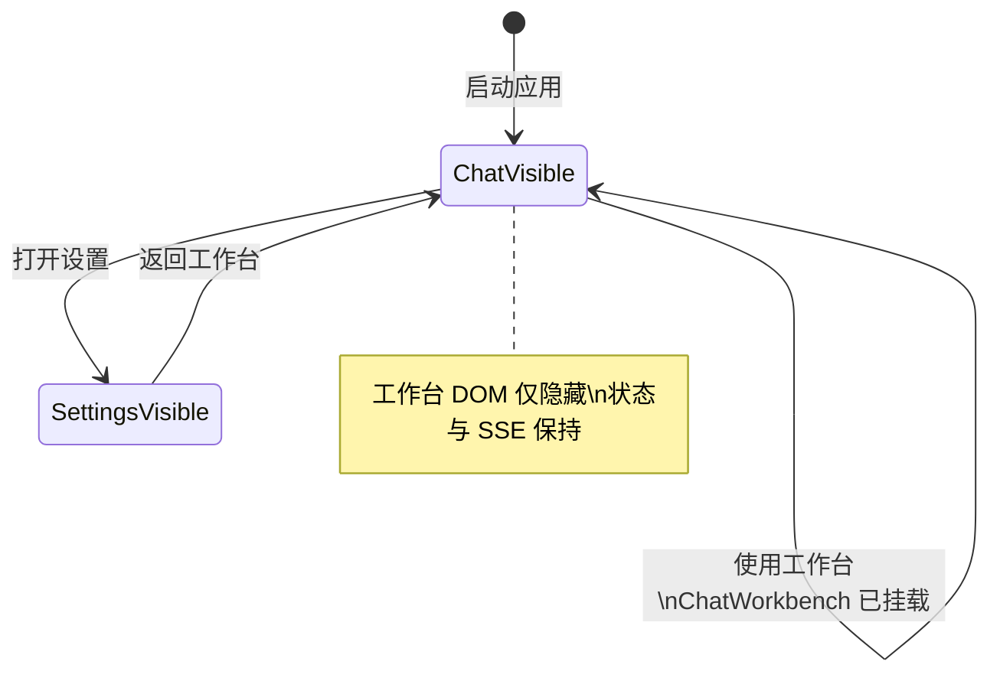
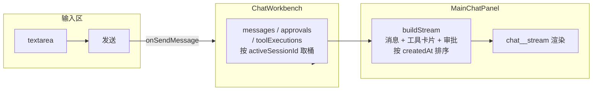
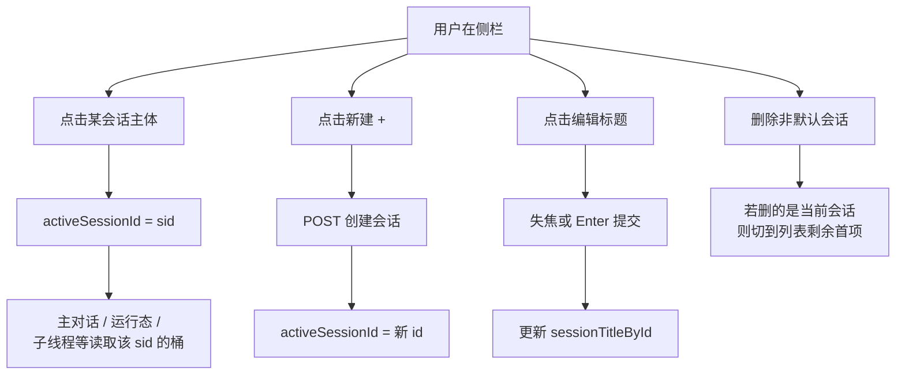
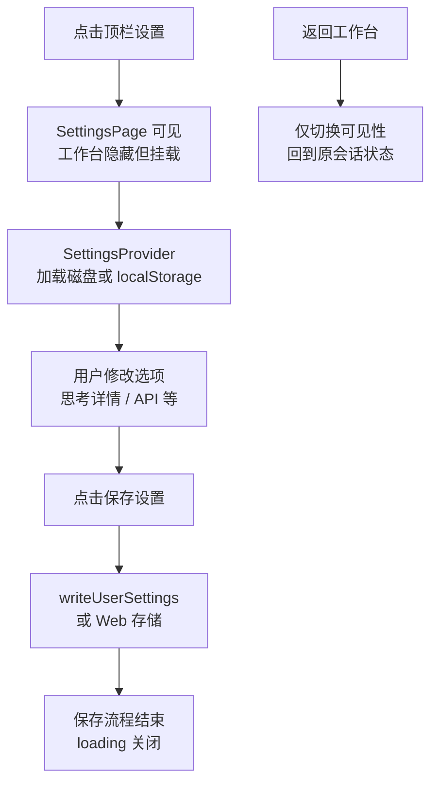
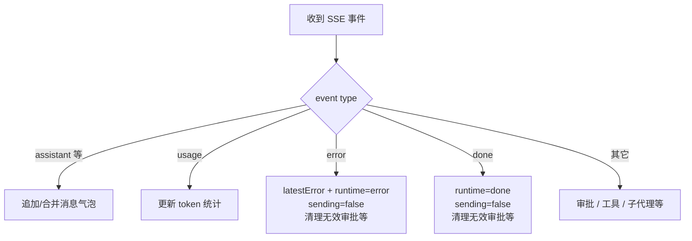

# 各界面与交互行为说明

本文描述 **DAgentsUI** 工作台中主要 **UI 区域** 的展示规则与用户可操作行为，便于测试与产品对齐。实现以源码为准；若有出入以代码行为优先。

---

## 1. 应用壳层（`App.tsx`）

| 行为 | 说明 |
|------|------|
| 对话与设置切换 | 根组件在「工作台」与「设置」之间切换视图；**工作台（`ChatWorkbench`）始终挂载**，仅通过隐藏/显示切换可见性，**从设置返回不会清空会话与消息**。 |
| 设置入口 | 工作台顶栏提供设置按钮（若传入 `onOpenSettings`）；打开后覆盖为设置页。 |

**视图切换与组件生命周期**：

---

## 2. 工作台顶栏（`ChatWorkbench` 内 `app__header`）

| 元素 | 行为 |
|------|------|
| 品牌区 | 展示产品标题与副标题（如「DAgents Workbench」「多 Agent 工作台」）。 |
| 设置按钮 | 点击后进入设置页；不销毁工作台状态。 |

---

## 3. 主对话区（`MainChatPanel`）

### 3.1 顶栏

| 元素 | 行为 |
|------|------|
| 标题 | 「主对话 / 当前对话」文案。 |
| 待审批 pill | 当前会话内**未处理**审批任务中，**待处理工具调用条数**大于 0 时显示黄色警示样式及数量。 |
| 消息数 pill | 展示当前传入的 `messages` 数组长度（与会话绑定；与流内过滤规则不同，仅作粗略计数）。 |

### 3.2 聊天流（时间线混合）

流内条目由 **消息、工具执行卡片、审批气泡** 按 `createdAt` **合并排序** 展示。

**消息气泡（`MessageBubble`）**

| 类型 / 状态 | 展示与规则 |
|-------------|------------|
| **用户** | 右侧对齐气泡；无「you」等小标签。 |
| **助手** | 左侧；正文使用 **Markdown + GFM** 渲染；链接新标签打开；图片使用受控样式。 |
| **推理（reasoning）** | 可显示 `thinking` 标签与流式点动画；若开启「展示思考详情」则流式展示全文，否则为折叠占位（见设置）。 |
| **生成中占位（generating）** | 在助手开始流式输出前可显示「generating」与等待点动画。 |
| **工具类文本消息（tool）** | 居中宽条样式，带 `tool` 提示。 |
| **空内容** | 除「生成中」「折叠推理」等特殊状态外，**纯空白消息不进入流**，避免空泡。 |
| **首尾空白** | 对 assistant / reasoning 的展示文本做首尾空行裁剪，减轻「多出一行空白」观感。 |

**工具执行气泡（`ToolExecutionBubble`）**

| 行为 | 说明 |
|------|------|
| 状态 | 展示「执行中 / 已完成 / 已拒绝 / 失败」及对应图标或转圈。 |
| 写文件 / 读文件类工具 | 有专门标题行、路径展示与预览区；读文件支持可展开预览等。 |
| 其它工具 | 默认布局：工具名、摘要、按 `display_type` 渲染结果（终端/代码/文本/图片等），可展开详情（读文件类部分场景会隐藏部分详情逻辑以突出预览）。 |
| 结果元数据 | 后端返回 `truncated` / `sensitive_filtered` / `raw_ref` 时，卡片显示「输出已截断」「已脱敏」徽标与 raw_ref 路径，帮助用户理解为何展示内容不是完整原文。 |

**审批气泡（`ApprovalToolBubble`）**

| 行为 | 说明 |
|------|------|
| 列表 | 按审批任务内 `tool_calls` 列出每一行工具。 |
| 操作 | 每行可「拒绝」「批准」；提交中按钮会禁用并显示处理中。 |
| 状态 pill | 根据已批准/已拒绝/执行中/已返回等显示不同标签。 |
| 审批元数据 | 若后端随工具调用提供 `risk_level`、`approval_reason`、`approval_mode`，行内显示风险徽标、审批原因与策略来源，方便用户判断是否批准。 |

### 3.3 输入区

| 操作 | 行为 |
|------|------|
| **Enter** | 无 Ctrl 时：**发送**（阻止默认换行）。 |
| **Ctrl+Enter** | **插入换行**，不发送。 |
| 发送按钮 | 无内容、禁用态、或发送中时为禁用；发送中文案为「发送中…」。 |
| 无当前会话 | `disabled` 时输入区与发送不可用。 |

### 3.4 滚动

| 行为 | 说明 |
|------|------|
| 自动滚底 | 当流条目数量变化时，聊天流容器 **滚动到底部**，便于跟随最新内容。 |

**主对话区：从输入到时间线展示（数据视角）**：

说明：`onSendMessage` 由工作台实现，内部会调 HTTP；SSE 回流同样写入工作台的按会话分桶状态，再驱动 `MainChatPanel` 重算 `buildStream`。

---

## 4. 运行状态（`RuntimeStatusPanel`）

| 元素 | 行为 |
|------|------|
| Total tokens | 展示当前会话运行态中的累计 token 数（格式化数字）。 |
| SSE 连接 | 「已连接 / 已断开」及颜色区分。 |
| API 基址 | 展示当前工作台实际使用的 API 根地址，便于排查 `.env` 指错端口或误连其它服务。 |
| 错误区 | 若有 `latestError` 或运行态中的 `errorMessage`，在面板下方红色区域展示全文。 |

---

## 5. 子 Agent 区（`SubAgentThreadTabs` + `SubAgentThreadView`）

| 行为 | 说明 |
|------|------|
| 标题 | 「team Agent」及当前会话子线程数量 pill。 |
| 标签切换 | 点击不同子线程标签，仅更新**当前会话**下的选中子线程。 |
| 内容区 | 展示选中线程的标题、状态 pill、chunk 列表（输出/小结/工具/错误等类型标签与时间）。 |
| 未选中 | 显示「请选择一个子线程查看实时输出」。 |
| 无 chunk | 显示「等待输出…」。 |

**与全局事件的关系（摘要）**：子线程数据由 SSE 写入；当新子代理在**当前正在浏览的会话**中启动时，可自动选中该子线程；**切换至其它会话后**，不会因其它会话的 SSE **自动切回**该会话（见工作台内会话与 ref 逻辑）。

---

## 6. 历史会话（侧栏会话列表）

| 操作 | 行为 |
|------|------|
| 切换会话 | 点击某条主体区域，将 **当前激活会话** 设为该项；主对话与右侧状态均随 `activeSessionId` 切换数据源。 |
| 新建会话 | 顶部「+」调用后端创建会话，成功后 **切换到新会话**。 |
| 默认会话 | 列表中有固定默认会话；**不可删除**（删除按钮不出现或无效）。 |
| 编辑标题 | 点击编辑图标进入输入框；**失焦**或 **Enter** 提交非空标题；**Escape** 取消编辑。 |
| 删除 | 非默认会话可删除；删除后若删的是当前会话，会切到列表中剩余第一项（若有）。 |
| 列表顺序 | 默认会话固定靠前，其余按创建顺序的逆序展示（最新靠前，与实现一致）。 |

**会话列表：用户操作路径**：

---

## 7. 设置页（`SettingsPage`）

| 行为 | 说明 |
|------|------|
| 返回 | 「返回工作台」关闭设置视图，回到先前工作台状态（消息仍在）。 |
| 加载 | 设置未加载完成时显示「正在加载设置…」。 |
| 对话展示 | 勾选「展示思考详情」控制是否在主对话中流式展示 reasoning；关闭则主要为折叠占位 + 动画。 |
| API（Electron） | 在 Electron 下可编辑「真实 DAgents API 根地址」草稿；保存时写入用户设置并参与代理目标。 |
| 配置文件路径 | Electron 下可展示用户设置文件磁盘路径；Web 下说明为 localStorage 键名等。 |
| 保存 | 「保存设置」写入持久化；保存过程有 loading 文案。 |

**设置：从进入到落盘**：

---

## 8. 与后端状态相关的 UI 收敛（摘要）

下列行为影响「发送中」「待审批」「运行态」等，**不单由 UI 决定**，但与界面表现直接相关：

| 场景 | UI 侧表现（摘要） |
|------|-------------------|
| 发送消息 | 发送前置为发送中；成功后依赖 SSE；若长时间无首包可显示生成中占位（见实现）。 |
| 本轮 `done` / `error` | 会收敛发送中、运行态，并按产品策略清理**已失效**审批等（避免数字与可操作状态不一致）。 |
| SSE 断开 | 连接状态显示断开；运行中会话可能被标记为连接类异常（见实现）。 |

**运行态与发送态：随 SSE 收敛（概念）**：

---

## 9. 相关文档

- [architecture-and-business-flows.md](./architecture-and-business-flows.md)：技术架构与端到端业务流程。
- [cross-origin-solutions.md](./cross-origin-solutions.md)：跨域与 CORS 技术方案。
- [README.md](./README.md)：`doc/` 目录索引。
